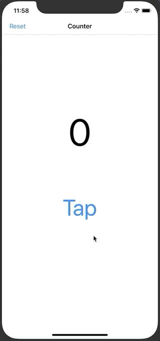
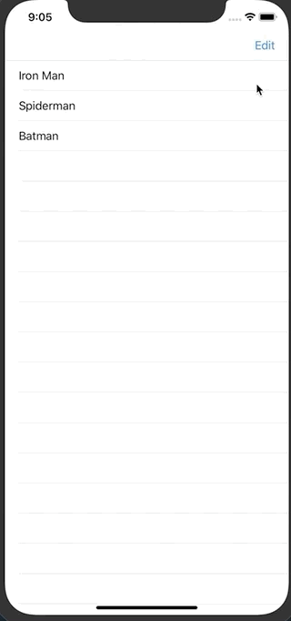
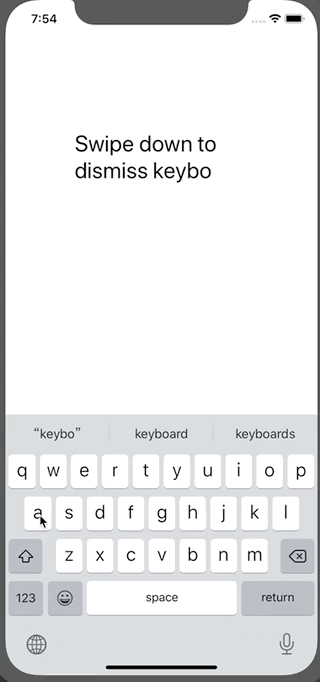
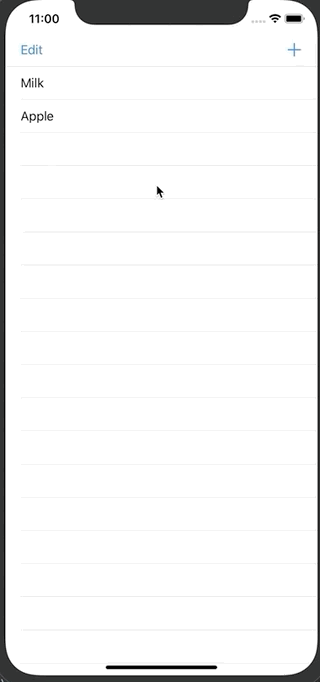
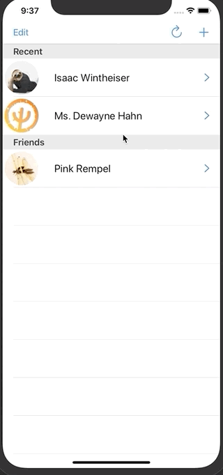
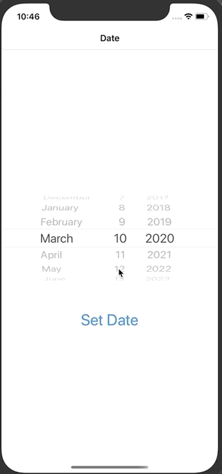
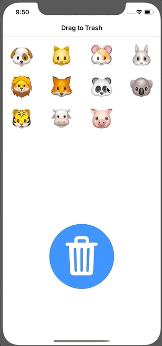
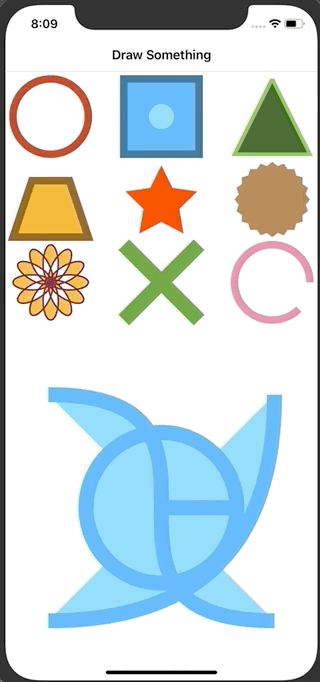

## 100 Days of Swift 5

**超过16个 Swift 5 小项目，帮助入门者快速学习如何搭建 ios 。**

项目灵感来源于 [samvlu's 100-days-of-swift](http://samvlu.com/index.html)，**并用 Swift 5 重写。** 部分资源来自 [Edison Hsu](https://github.com/Edison-Hsu/100-days-of-RxSwift)。

开发环境：

- Swift 5
- Xcode 11.3.1
- Simulator iPhone 11
- IOS 13.2

注意，项目并不包含对 Swift 基础知识的讲解。如果你完全搞不清楚它们是如何实现的，请先学习以下内容：

- [Swift 编程语言中文版](https://www.cnswift.org/)
- [斯坦福 CS193P Swift 公开课](https://www.bilibili.com/video/av16339375)

**编程愉快**

> 项目代码与 samvlu 的有所区别，因为我是完全自己写的。废弃了部分过时的项目、合并了相似的项目。

### Day 1 - Tap Counter

我学到了：

- 运用标签、按钮
- 将界面元素链接到代码中
- 自定义导航栏

### Day 2 - Tap Or Hold Counter

 我学到了：

- 定义长按手势

### Day 3 - Tip Calculator

我学到了：

- 滑动条
- 文本框
- 定义点击手势
- 运用 Extension

### Day 4 - Basic Table View

我学到了：

- 运用列表控制器
- 导航栏按钮
- 在列表中填充数据

### Day 5 - Getting Current Date and Time

我学到了：

- 获取时间
- 时间格式化

### Day 6 - Passing Data to Another View

我学到了：

- 用 segue 传输数据

### Day 7 - Swipe Down to Dismiss Keyboard

我学到了：

- 运用轻扫手势
- 自动弹出键盘

### Day 8 - Add Photo from Camera Roll

我学到了：

- 从图库中获取图片
- 缩放图片并添加到文本中

### Day 9 - Pull to Refresh TabelView

我学到了：

- 如何刷新数据

### Day 10 - Add New Item

我学到了：

- 自动弹出键盘
- 运用闭包回传数据

### Day 11 - Sticky Section Headers

我学到了：

- 给列表设置标题
- 索引字典

### Day 12 - Tableview Jumpbar

我学到了：

- 配置数据流
- 定义跳转栏

### Day 13 - Dynamic Data for Each Cell

我学到了：

- 列表控制器的综合运用
- 操作列表的数据
- 读写 json 文件
- MVC 模式
- 运用 segue/closure 传输数据
-  用 CocoaPod 安装库

### Day 14 - Set Current Location

我学到了：

- 获取地理位置

### Day 15 - Setting The Date

我学到了：

- 从时间拾取器中获取时间

### Day 16 - Save Date Location Photo

我学到了：

- 自定义键盘工具栏
- 在按钮中使用图标
- 回传导航栏数据

## Day 17 - Basic Collection View

我学到了：

- 集合控制器的运用
- 集合视图元素的拖拽
- 改变集合视图的布局
- 基本的动画

## Day 18 - Drag and Drop Item Out of CollectionView

我学到了：

- 通过拖拽向另一个视图传递数据

## Day 19 - Draw Something

我学到了：

- 基础绘图

## Day 20 -Animate It

我学到了：

- 通过 CAAnimation && Transition && UIView.animate 实现动画效果
- 通过闭包存储局部变量