

## 100 Days of Swift 5

**More than 16 tiny projects to help you quickly learn how to build a simple iPhone app.**

👉🏼 [中文传送门 / Chinese Version](README-CN.md) 👈🏼

Similar with [samvlu's 100-days-of-swift](http://samvlu.com/index.html), **but write by Swift 5.** Some resource comes from [Edison Hsu](https://github.com/Edison-Hsu/100-days-of-RxSwift).

Code environment:

- Swift 5
- Xcode 11.3.1
- Simulator iPhone 11
- IOS 13.2

These projects does not include an explanation of the basics of Swift. If you do not understand how the code works, please learn the following tutorial first:

- [The Swift Programming Language](https://swift.org/)
- [Stanford CS193P Developing Applications for iOS](http://web.stanford.edu/class/cs193p/cgi-bin/drupal/)

**Happy programming!**

> The code is different from the samvlu's version because I write it myself. Obsolete projects have been deleted and similar projects have been merged together.

### Day 1 - Tap Counter

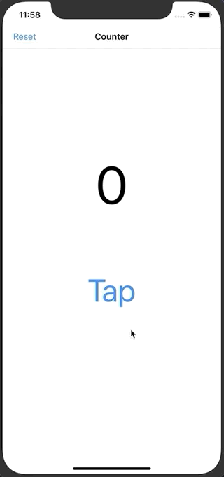

What I Learned:

- How to use UIButton & UILabel
- IBOutlet & IBAction
- Custom Navigation item

### Day 2 - Tap Or Hold Counter

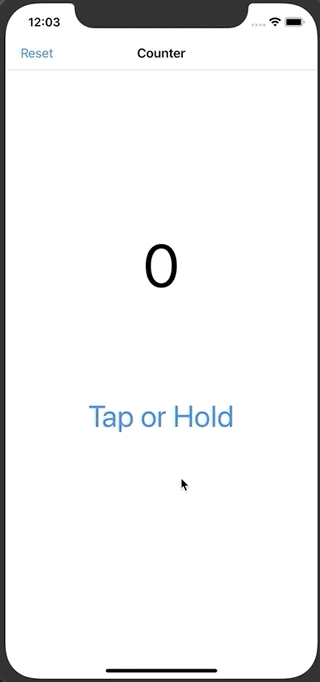

What I Learned:

- UILongGestureRecognizer

### Day 3 - Tip Calculator

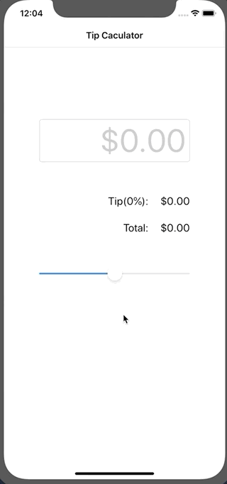

What I Learned:

- UISlider
- Text Field
- UITapGestureRecognizer
- How to make code clean with Extension

### Day 4 - Basic Table View

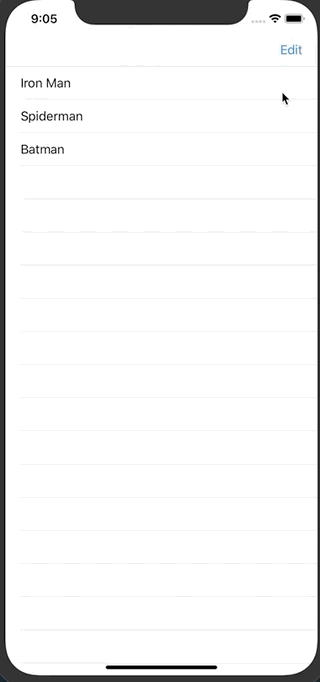

What I Learned:

- Build Custom Table View Controller
- Work with Nav Bar Buttons
- Populate Table Rows with local data

### Day 5 - Getting Current Date and Time

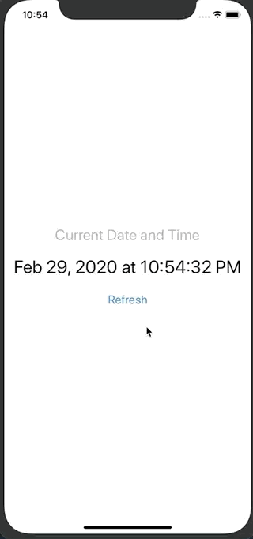

What I Learned:

- Work with Date()
- Hot to use DateFormatter with build in dateStyle and timeStyle

### Day 6 - Passing Data to Another View

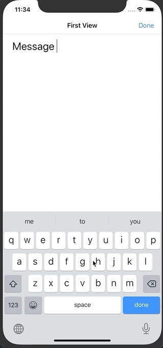

What I Learned:

- Send data through segue

### Day 7 - Swipe Down to Dismiss Keyboard

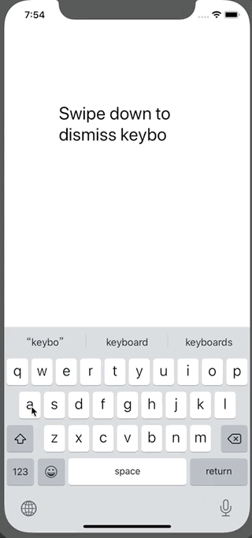

What I Learned:

- How to use UISwipeGestureRecognizer
- Auto-launch the Keyboard when the View loads

### Day 8 - Add Photo from Camera Roll

What I Learned:

- UIImagePickerController
- Scale image and append it to TextField

### Day 9 - Pull to Refresh TabelView

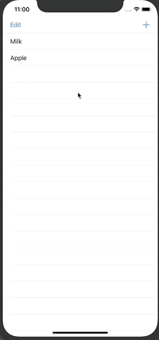

What I Learned:

- Hot to refresh data

### Day 10 - Add New Item

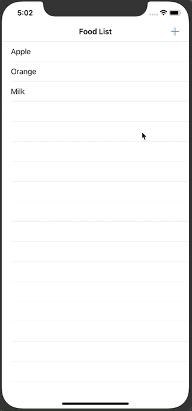

What I Learned:

- How to show keyboard when view appear
- How to pass data back to view controller by closure

### Day 11 - Sticky Section Headers

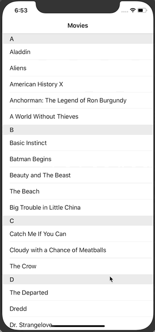

What I Learned:

- Build sticky section tableview
- Use Array to index Dictionary

### Day 12 - Tableview Jumpbar

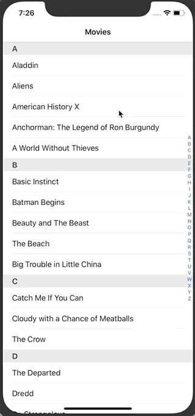

What I Learned:

- How to config dataSource
- Learn Create an Indexed Table View

### Day 13 - Dynamic Data for Each Cell

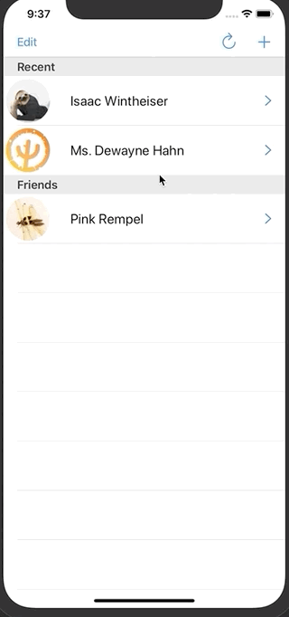

What I Learned:

- Comprehensive application for UITableViewController
- Create/Update/Delete/Review Data in tableView
- Read/Write json data to file
- MVC design concept
- Transmit information by segue/closure
-  How to use CocoaPod to install frameworks

### Day 14 - Set Current Location

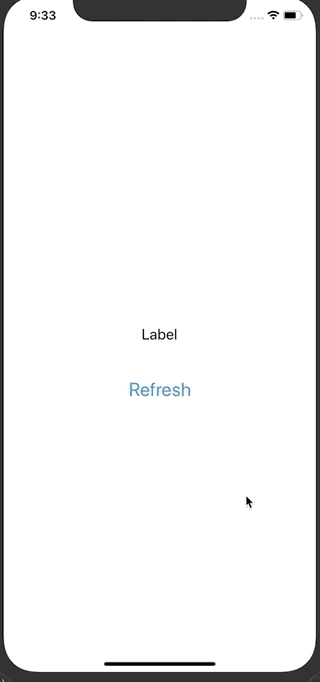

What I Learned:

- Get current location

### Day 15 - Setting The Date

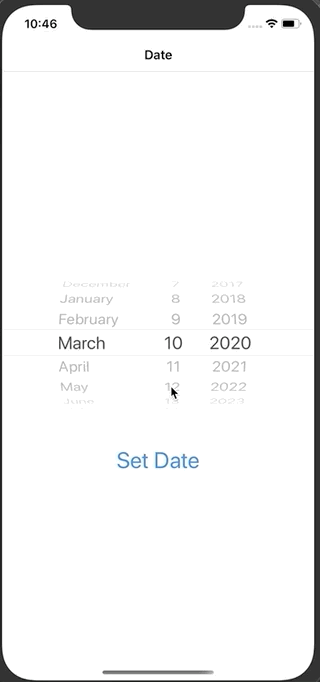

What I Learned:

- How to format date from DatePicker

### Day 16 - Save Date Location Photo

What I Learned:

- Create an Accessory Input View
- Use icons for UIButtons
- Pass data back to rootView

## Day 17 - Basic Collection View

What I Learned:

- Baic using of UICollectionViewController
- Drag and Drop in collection view
- Change the layout of collection view
- Basic animation

## Day 18 - Drag and Drop Item Out of CollectionView

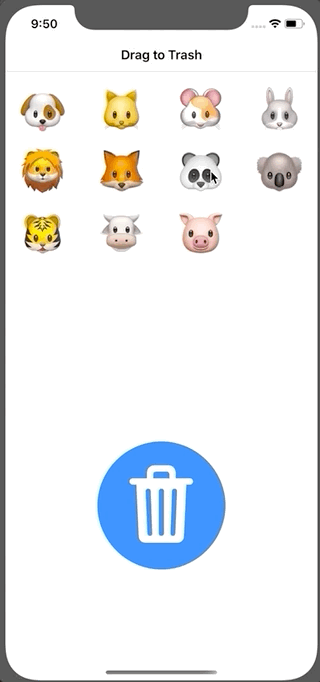

What I Learned:

- Pass data from collection to another view by drag and drop

## Day 19 - Draw Something

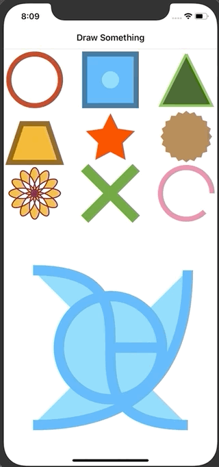

What I Learned:

- Basic Drawing with CAShapeLayer and UIBezierPath